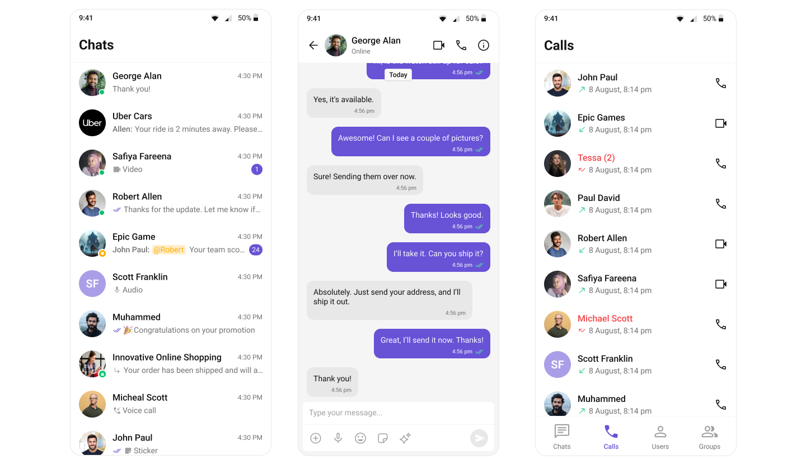

  

# CometChat Flutter UI Kit

CometChat Flutter UIKit provides a pre-built user interface kit that developers can use to quickly integrate a reliable & fully-featured chat experience into an existing or a new mobile app. 

   

## 🚀 Explore the Sample Apps!

Dive straight into our Sample Apps to see CometChat UI Kit in action! Whether you're building a messaging app or enhancing your existing project, this sample app showcases the full potential of our Flutter UI components.  
- [Sample App ](sample_app#readme)
- [Sample App with Push Notifications](sample_app_push_notifications#readme)

## Prerequisites

**iOS**
- XCode
- Pod (CocoaPods) for iOS
- An iOS device or emulator with iOS 12.0 or above.

**Android**
- Android Studio
- Android device or emulator with Android version 5.0 or above.

## Getting Started

To set up Flutter Chat UIKit and utilize CometChat for your chat functionality, you'll need to follow these steps:
1. Registration: Go to the [CometChat Dashboard](https://app.cometchat.com/) and sign up for an account.
2. After registering, log into your CometChat account and create a new app. Once created, CometChat will generate an Auth Key and App ID for you. Keep
   these credentials secure as you'll need them later.
3. Check the [Key Concepts](https://www.cometchat.com/docs/fundamentals/key-concepts) to understand the basic components of CometChat.
4. Refer to the [Integration Steps](https://www.cometchat.com/docs/ui-kit/flutter/5.0/getting-started) in our documentation to integrate the UI Kit into your iOS app.

## Help and Support

For issues running the project or integrating with our UI Kits, consult our [documentation](https://www.cometchat.com/docs/ui-kit/flutter/5.0/overview)
or create a [support ticket](https://help.cometchat.com/hc/en-us) or seek real-time support via the [CometChat Dashboard](https://app.cometchat.com/).
