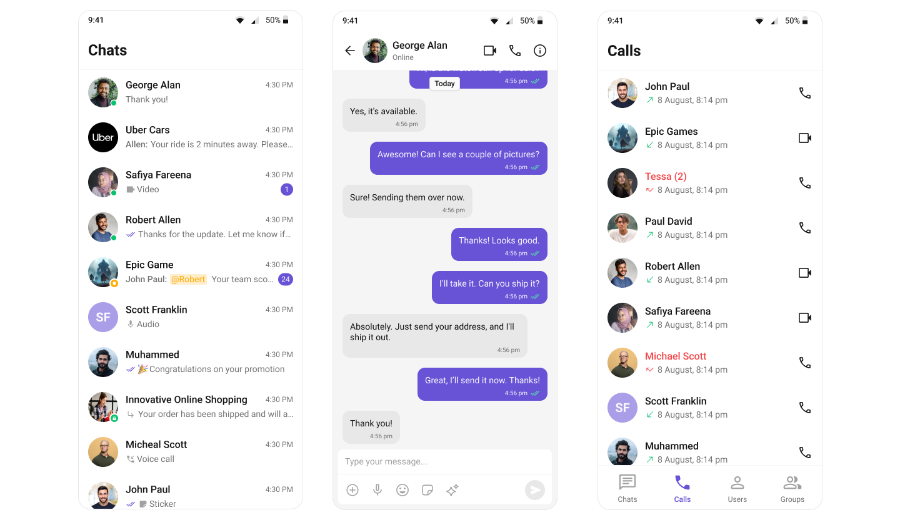

<p align="center">
  
</p>

# Flutter Sample App by CometChat

This is a reference application showcasing the integration of [CometChat's Flutter UI Kit](https://www.cometchat.com/docs/ui-kit/flutter/5.0/overview) in a Flutter project. It demonstrates how to implement real-time messaging and voice/video calling features with ease.

<div style="display: flex; align-items: center; justify-content: center">
   
</div>


## Prerequisites

Ensure the following are installed and configured on your system:

- **Development Environment:**
  - Xcode (for iOS)
  - Android Studio (for Android)
  - Flutter SDK (latest stable version)
  - CocoaPods (for iOS dependencies)

- **Supported Platforms:**
  - iOS: Version 12.0 or higher
  - Android: Version 5.0 (API level 21) or higher

- **CometChat Credentials:**
  Sign up at [CometChat](https://app.cometchat.com/) to obtain:
  - `App ID`
  - `Region`
  - `Auth Key`

---

## Installation

1. Clone the repository:
   ```sh
   git clone https://github.com/cometchat/cometchat-uikit-flutter.git
   ```

2. Checkout v5 branch:
   ```sh
   git checkout v5
   ```

3. Open the project in Android Studio by navigating to the cloned directory and open the `cometchat-uikit-flutter` folder.

4. Sync Dependencies.
    ``` 
    flutter pub get
    ```

5. Install and configure the [FlutterFire CLI](https://firebase.google.com/docs/flutter/setup?platform=ios#install-cli-tools)

6. Add Firebase configuration to your apps:

    ``` 
    flutterfire configure 
    ```


7. `[Optional]` Configure CometChat credentials:
   - Open the `AppCredentials.dart` file located at `sample_app/lib/AppCredentials.dart` and enter your CometChat _`App ID`_, _`Region`_, and _`Auth Key`_:
     ```dart
     AppCredentials {
        static String _appId = "YOUR_APP_ID";
        static String _authKey = "YOUR_AUTH_KEY";
        static String _region = "REGION";
     }
     ```

8. In the Run/Debug Configurations dropdown (on the top toolbar), select the preconfigured `sample_app` run configuration. Connect a `physical device` or select an `emulator` from the Device Selector dropdown. Click the Run ▶ button to launch the app.


## Help and Support

For issues running the project or integrating with our UI Kits, consult our [documentation](https://www.cometchat.com/docs/ui-kit/android/5.0/getting-started) or create a [support ticket](https://help.cometchat.com/hc/en-us). You can also access real-time support via the [CometChat Dashboard](http://app.cometchat.com/).